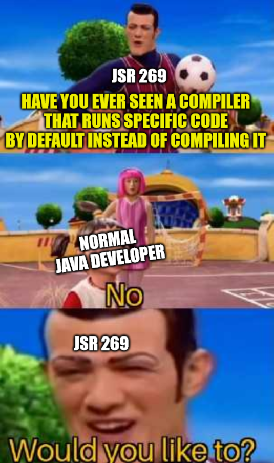

# Java Annotation Processing Code Execution

> [!NOTE]
> This is effectively **fixed in Java 23** as [annotation processing is now disabled by default](https://www.oracle.com/java/technologies/javase/23-relnote-issues.html#JDK-8321314).

This is a test library to check if your compiler automatically executes Java Annotation Processors.

> [!WARNING]
> This library will likely crash the compiler

## Background



[JSR 269](https://jcp.org/en/jsr/detail?id=269) introduced Annotation processing into Java.<br/>
Annotation processing is done by the Java compiler itself (because it's from a time before buildtools like Maven or Gradle).

This itself is not a problem but the following design aspects are:
> Unless annotation processing is disabled with the `-proc:none` option, the compiler searches for any annotation processors that are available. The search path can be specified with the `-processorpath` option. If no path is specified, then the user class path is used. Processors are located by means of service provider-configuration files named `META-INF/services/javax.annotation.processing` ... <sup>[[Javac Documentation]](https://docs.oracle.com/en/java/javase/17/docs/specs/man/javac.html#annotation-processing)</sup>

So if a malicious or manipulated library somehow ends up in your project, it can execute ANY code when compilation happens due to [Java's service-loading](https://docs.oracle.com/en/java/javase/17/docs/api/java.base/java/util/ServiceLoader.html).

Everything that uses a Java Compiler (like `javac` or `ecj`) with the default options (IDEs like Eclipse/IntelliJ or the maven-compiler-plugin) is affected.

## Testing if your code is attackable

1. Specify the code you want to run inside [CodeExecutionProcessor](./src/main/java/software/xdev/CodeExecutionProcessor.java)
2. Build the library by running `mvn clean install`
3. Add the following dependency to your code:<br/>
	⚠ If you use Eclipse: Make sure that "Build automatically" is disabled! (see below)
	```xml
	<dependency>
		<groupId>software.xdev</groupId>
		<artifactId>java-annotation-processing-code-execution</artifactId>
		<version>1.0-SNAPSHOT</version>
	</dependency>
	```
4. Compile/Build your code using maven, your IDE or whatever. 

→ The code inside CodeExecutionProcessor should be executed

## Mitigation / How to fix this?

### Java-Compiler
As mentioned above there is a compiler flag [`-proc:none`](https://docs.oracle.com/en/java/javase/17/docs/specs/man/javac.html#option-proc) which disables annotation processing by the compiler.

### Maven
Ensure that the compiler is executed with `-proc:none`, like this:
```xml
<plugin>
	<groupId>org.apache.maven.plugins</groupId>
	<artifactId>maven-compiler-plugin</artifactId>
	<version>3.10.1</version>
	<configuration>
		<compilerArgs>
			<arg>-proc:none</arg>
		</compilerArgs>
	</configuration>
</plugin>
```

The best solution is to configure this in all modules by doing it inside the parent poms ``build -> pluginManagement -> plugins``-section

### IDEs

IDEs usually have custom support for Annotation Processing.

#### IntelliJ IDEA

IDEA automatically imports the `-proc:none` argument from Maven if configured correctly.<br/>
However this doesn't disable the Annotation Processors which are defined in Maven `pom.xml`s and they are still executed when building, which leads to errors like `java: java.lang.ClassNotFoundException: org.hibernate.jpamodelgen.JPAMetaModelEntityProcessor`.<br/>
[You have to disable them in the settings](https://www.jetbrains.com/help/idea/annotation-processors-support.html).

#### Eclipse

> [!WARNING]
> Adding this library might cause the IDE to crash because the build process is not sandboxed.<br/>
You might be no longer able to open your project because Eclipse instantly rebuilds the project on restart which causes a crash again.<br/>
So make sure that "Build automatically" is disabled!

As far as I have seen Eclipse is not affected by default because Annotation processing isn't enabled by default (or not implemented in a stable way?).<rb/>
However if you e.g. set `Settings: Maven > Annotation Processing : Annotation Processing Mode` to `Experimental: Delegate annotation processing to maven plugins`
or if you enable it inside a project (`Right click project : Properties : Java Compiler > Annotation Processing : Enable annotation processing`) the complete IDE will crash.

